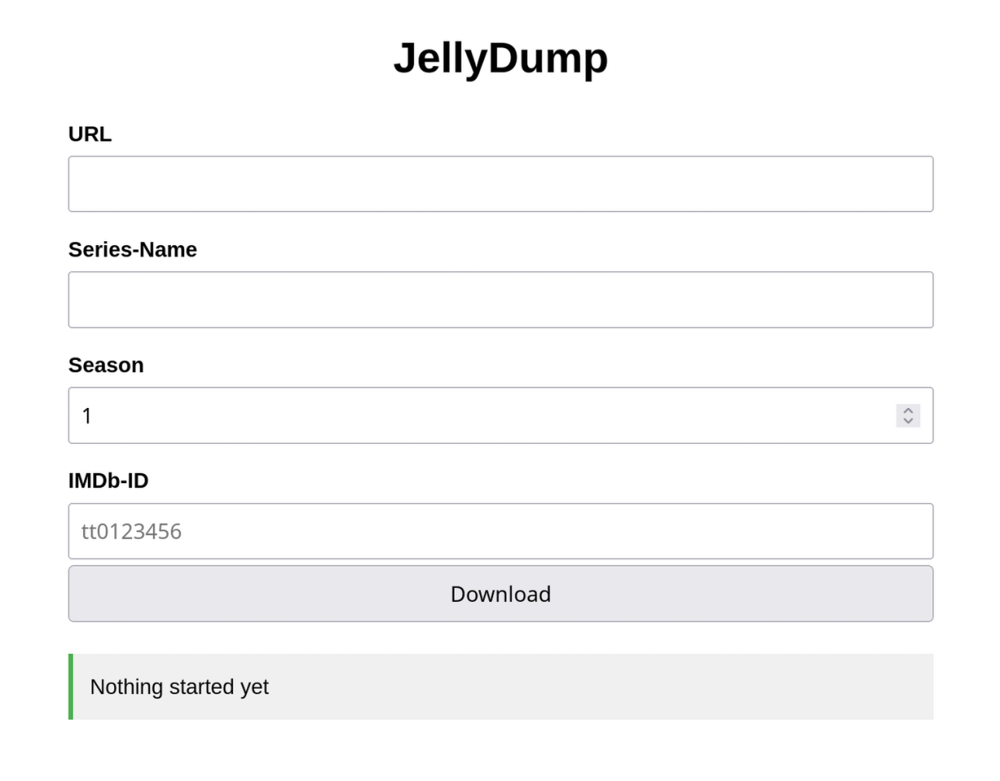

Small tool to dump a Youtube playlist as a show to jellyfin.  

Will create a folder based on the specifications of [Jellyin TV Shows config](https://jellyfin.org/docs/general/server/media/shows/).   
Use the env-variable ``BASE_DATA_PATH`` to set the ``Shows`` folder.  
Has a small webinterface for starting jobs:

